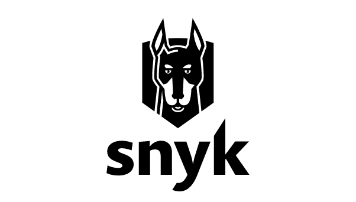
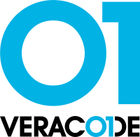

# I Layer Engine  

In the first stage, Meerkat gets information about possible vulnerabilities that can cause or backdoor it.      
Examples of the classic vulnerabilities that can be discovered at the first layer are: 
- Use after free
- XSS
- SQL / NoSQL injection
- Stack / Heap Overflow  
- Usage of the deprecated functions
  
and much more...  
The first layer is **additional** and not required but **strongly** recommended. 
 

 

## Interation
If your company/organization already use one of the vulnerability scanners you can connect it to Meerkat as the first layer engine.
All you need to do is choose the used solution and pass the API key in the configuration file.   
Then Meerkat takes advantage of the results returned by Snyk, Veracode or other supported vulnerability scanners in the final trust factor calculation.

 

       
